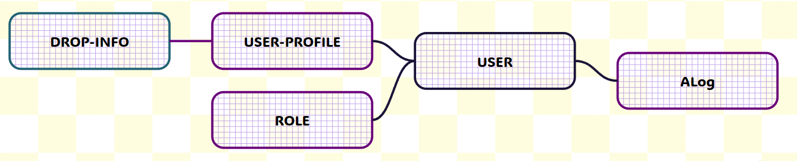

# Русская рулетка,
 но при каждом выстреле падает один из микросервисов.

## Содержание
- [Наша команда](#команда-microservices-adventure)
- [Tech Stack](#tech-stack)
- [Текущее состояние проекта](#текущее-состояние-проекта)
- [Запуск проекта](#запуск-проекта)
- [Описание сервисов](#описание-сервисов)
- [Документация](#документация)
- [Базы данных](#сущности-баз-данных)

## Команда Microservices Adventure
1. Казанков Руслан - Team Lead, Fullstack
2. Спиваченко Михаил - Backend-Developer
3. Заголовец Иван - Тестировщик

## Tech Stack
- ASP NET MVC - клиент, веб приложение.
- ASP NET API - веб приложение для rest api запросов и background-сервисов для чтения сообщений из kafka.
- Razor pages - фреймворк для разработки страниц с использованием C#.
- Bootstrap5 - фреймворк для дизайна.
- xUnit - фреймворк для тестирования.
- Postgres - базы данных в микросервисах.
- EntityFrameworkCore - ORM для баз данных.
- Kafka - брокер сообщений.
- Docker - для запуска и управления микросервисного веб приложения.
  
## Текущее состояние проекта
- Frontend - веб приложение ASP NET MVC. Проект приведён к FSD архитектуре, но папки Properties и wwwroot остались в корне проекта из-за особенностей ASP NET приложения.
- XUnitTestProject - проект с тестами, который активно ведётся.
- Authorization - 🟢 Готово!
- Revolver - 🟢 Готово!
- ActionLog - 🟢 Готово!
- LiveMonitor - 🟢 Готово!
- Profile - 🟢 Готово!
  
## Запуск проекта
1. Скачать [Docker-Desktop](https://www.docker.com/products/docker-desktop/). Установить и запустить.
2. Склонировать репозиторий на локальную машину.
3. Запустить проект из папки с файлом docker-compose.yml:
```
docker-compose up -d
```
4. Подождать запуск всех контейнеров и перейти по одному из адресов:
- https://localhost:8081
- http://localhost:8080

Во втором случае всё равно произойдёт перенаправление на https адрес.

## Описание сервисов
### **Frontend**
Frontend - ASP NET MVC веб-клиент приложения. Именно сюда попадают пользователи, когда заходят на наш сайт. Здесь весь пользовательский интерфейс и "ручки" через которые происходит обращение к бэкенду.
### **Authorization**
AuthorizationAPI - ASP NET Web API приложение для авторизации пользователей.
### **ActionLog**
ActionLog - сервис для публичных логов. Когда пользователи регистрируются или стреляют из револьвера, то действия пользователя отправляются в публичную таблицу логов.
### **Revolver**
Revolver - Сервис для стрельбы по другим сервисам. Когда происходит выстрел по другому сервису, то тот падает, но через определённое время встаёт.
### **LifeMonitor**
LifeMonitor - Сервис который следит за здоровьем других сервисов. На главной странице отображает, какой сервис упал, какой стоит, а какой имеет неуязвимость на какое-то время.
### **Profile**
Profile - Сервис с историей выстрелов пользователя. После регистрации пользователь может перейти на свою страницу с главной страницы.

# Документация
## Authorization
### rest api:
- post /api/account/login - залогиниться
- post /api/hearth/kill - убить сервис
- get /api/hearth/isLive - проверить, живой ли сервис
- get /api/hearth/killAvailable - проверить, нет ли кулдауна у сервиса, то есть можно ли его убить

### kafka register consumer:
- topic: auth_register_events - зарегистрироваться

## Revolver
### rest api:
- post /api/gun/shoot - выстрелить в случайный сервис
- post /api/hearth/kill - убить сервис
- get /api/hearth/isLive - проверить, живой ли сервис
- get /api/hearth/killAvailable - проверить, нет ли кулдауна у сервиса, то есть можно ли его убить

## ActionLog
### rest api:
- get /api/logs/getlist - получить список логов, есть пагинация и фильтры
- post /api/logs/add - добавить лог
- post /api/hearth/kill - убить сервис
- get /api/hearth/isLive - проверить, живой ли сервис
- get /api/hearth/killAvailable - проверить, нет ли кулдауна у сервиса, то есть можно ли его убить

### kafka log consumer:
- topic: add_log_events - добавить лог

## LifeMonitor:
### rest api:
- get /api/life/getLifes - получить состояние здоровье других сервисов(жив ли, доступен ли для убийства)

## Profile:
### rest api:
- post /api/profile/adduser - добавить пользователя
- get /api/profile/getuser - получить пользователя с его историей
- post /api/profile/adddropinfo - добавить информацию в историю
- post /api/hearth/kill - убить сервис
- get /api/hearth/isLive - проверить, живой ли сервис
- get /api/hearth/killAvailable - проверить, нет ли кулдауна у сервиса, то есть можно ли его убить

### kafka profile consumer:
- topic: add_profile_events - добавить пользователя

# Сущности баз данных:

### В каждом сервисе используется своя база данных postgres, id в сущностях опущены.
## Authorization
- User - пользователь
    - Имя пользователя
    - Email
    - Пароль
    - Список ролей
- Role - роль пользователя
    - Название роли
    - Нормализированное название роли
- Связь User : Role - 1 ко многим.

## ActionLog
- ALog - лог события
    - Имя пользователя
    - Email пользователя
    - Имя микросервиса, откуда пришёл лог
    - Описание лога
    - Статус действия: Success | Fail | Proccess
    - Ошибка? - Сообщение об ошибке, если это сообщение об ошибке
    - Дата и время события
- Межсервисная связь с сервисом авторизации ALog : User - многие ко многим

## UserProfile
- UserProfile - профиль пользователя с историей упавших сервисов
    - Имя пользователя
    - Email пользователя
    - Список упавших сервисов
- DropInfo - упавший сервис
    - Имя сервиса
    - Дата и время падения сервиса
- Связь UserProfile : DropInfo - 1 ко многим
- Межсервисная связь с сервисом авторизации UserProfile : User - 1 к 1
